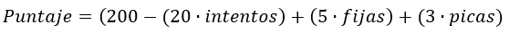
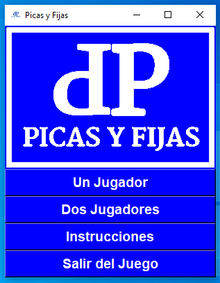

<p align="center"></p>

# Proyecto Final

___

<p align="center"></p>

## 1. Introducción

Para el proyecto final de Introducción a las Ciencias de la Computación y a la Programación, desarrollé en Python un juego llamado **Picas y Fijas**. El objetivo del juego es adivinar un número de cuatro dígitos que no se repiten. El número es generado aleatoriamente por el programa en el modo de un solo jugador, e introducido por el contrincante en el modo de dos jugadores. Las pistas que se le proporcionan al usuario para que adivine correctamente los cuatro dígitos que componen el número y su respectivo orden se llaman *picas* y *fijas*. Las *picas* indican los dígitos que forman parte del número a adivinar, pero no se encuentran en la posición correcta, y las *fijas* son los que cumplen ambas condiciones. Cuando el jugador consigue un total de cuatro fijas, es decir adivina el número, da fin al juego.

## 2. Instrucciones

El jugador cuenta con límite de diez intentos para adivinar el número. En cada intento ingresará un número de cuatro dígitos sin repetir ningún número. Luego, el programa le entregará el número de picas y fijas correspondientes al número ingresado. Al costado derecho de la ventana se irán almacenando los resultados de cada intento para que el jugador los tenga presentes. Cuando el jugador consiga las cuatro fijas se le entragará la puntuación que obtuvo en la partida. Si terminan los diez intentos y no se logró con el objetivo se le revelará cuál era el número correcto.

## 3. Modos de Juego

### 3.1. Un Solo Jugador

En este modo de juego, el jugador tendrá que adivinar un número generado aleatoriamente por la máquina dentro del límite de diez intentos.

### 3.2. Dos Jugadores

Cada jugador ingresará un número para que el otro lo adivine. Ambos tendran los diez intentos y el juego acabará cuando alguno de los dos consiga las cuatro fijas o cuando ambos hayan gastado todos sus intentos. Solo se le entregará puntaje al ganador, y en todos los casos se revelarán ambos números una vez terminado el juego.

## 4. Sistema de Puntuación

<p align="center"></p>

Al comienzo del juego, el jugador cuenta con doscientos puntos. Por cada intento que utilize se le descuentan veinte. Por cada fija se suman cinco puntos y por cada pica son tres más. Estas sumas y restas dan como resultado el puntaje final obtenido en la partida.

___

## 5. Desarrollo

Como se mencionó anteriormente el programá se desarrolló en python utilizando varias librerías, entre las que destaca [tkinter](https://docs.python.org/2/library/tkinter.html). Tkinter es una librería utilizada para crear [interfaces gráficas de usuario](https://es.wikipedia.org/wiki/Interfaz_gr%C3%A1fica_de_usuario) conocidas también como **GUI** \(del inglés *graphical user interface*).

### 5.1. Librerías

Las librerías utilizadas en el programa fueron: *tkinter* \(GUI), *PIL* \(Insertar imágenes en una ventana de tkinter) y *random* \(para generar el número aleatoriamente).

```python
from tkinter import *
from PIL import ImageTk, Image
from tkinter import messagebox
from random import randint
```

### 5.2. Menú

<p align="center"></p>

Lo primero que se hizo fue crear la ventana principal del programa donde quedaría el menú, crear los objetos *(labels y botones)* y asignar los comandos correspondientes.

```python
#Ventana menú
menu = Tk()
menu.tittle('Picas y Fijas')
menu.iconbitmap('picas.ico')
logo = ImageTk.PhotoImage(Image.open('picasblanco.png'))

#Comandos botones
#1. Salir
def salir():
  response = messagebox.askokcancel('Salir del Juego','¿Estás seguro de querer salir?')
  if response == 1:
    menu.quit()
    
#2. Instrucciones
def insbutton():
	messagebox.showinfo('Instrucciones','El juego consiste en adivinar un número de 4 dígitos donde ningún dígito se repite. Las pistas que tenemos para adivinar el número se  llaman picas y fijas. Las picas son aquellos dígitos que si se encuentran en el número original pero no están en la posición correcta. Las fijas son los que se encuentran en la posición que es. Se tiene un número máximo de 10 intentos, en cada intento se le entregan el número de fijas y picas correspondientes. Al lado derecho se almacenan todos los intentos con sus respectivos números de picas(P) y fijas(F). El juego acaba cuando el jugador logre tener en un intento 4 fijas que significa que adivinó el número, o cuando se le acaben los 10 intentos. En el modo de un solo jugador, se tiene que adivinar un número generado aleatoriamente por la máquina; y en el de dos jugadores, cada uno ingresará un número para que el contrario lo adivine, gana el primero que logré las 4 fijas.')
  
#3. Un Jugador
def s_player():

#4. Dos Jugadores
def d_player():

#Objetos
logolabel = Label(menu,bg='blue',image=logo).grid(row=0,column=0)
splayer = Button(menu,text='Un Jugador',bg='blue',fg='white',font='Arial 14 bold',command=s_player).grid(row=1,column=0,sticky=W+E)
dplayer = Button(menu,text='Dos Jugadores',bg='blue',fg='white',font='Arial 14 bold',command=d_player).grid(row=2,column=0,sticky=W+E)
instrucciones = Button(menu,text='Instrucciones',bg='blue',fg='white',font='Arial 14 bold',command=insbutton).grid(row=3,column=0,sticky=W+E)
exit = Button(menu,text='Salir del Juego',bg='blue',fg='white',font='Arial 14 bold',command=salir).grid(row=4,column=0,sticky=W+E)

menu.mainloop()

```

### 5.3. Modo Un Jugador

<p align="center"></p>

Al asignar un comando al botón de "Un Jugador" se crea una ventana secundaria donde se desarrollará este modo del juego. Se llevan variables globales para el número del intento, las fijas y picas obtenidas durante toda la partida y los puntos. Se crean los objetos y el botón "Confirmar" es el que ejecuta la comparación del número que se generó aleatoriamente y el ingresado por el usuario. El objeto *Entry* se borra al final de cada intento y se utilizan *labels* para entregar la cantidad de picas y fijas en cada intento. Por último se van agregando *Labels* en la parte derecha con los datos de cada intento, la fila *(row)* donde va ubicado cada grupo de datos está dado por el número del intento. Al final del ciclo el programa verifica si continuar o no, dependiendo de si el número de intentos es menor o igual a diez, o de que no se hayan conseguido aún las cuatro fijas.

```python
def s_player():
	
	#Ventana
	splayer_w = Toplevel()
	splayer_w.title('Picas y Fijas')
	splayer_w.iconbitmap('picas.ico')
	
	#Variables globales
	global intentos
	intentos = 1
	global puntos
	puntos = 200
	global fij_total
	fij_total = 0
	global pic_total
	pic_total = 0
	
	#Comando Botón Confirmar
	def sig():
		
		#Llamada de las variables globales para utilzirlas en la función
		global intentos
		global puntos
		global fij_total
		global pic_total
		
		#Generación del número a adivinar
		if intentos == 1: #Esto indica que solo se genere el número cuando se encuentre corriendo el intento número 1
			global num #Variable global donde se almacenará el número
			num = ''
			x = None
			while len(num) != 4:
			x = str(randint(0,9))
			if x in num: #Para que no se repitan dígitos
				pass
			else:
				num += x
		else:
			pass
		
		#Comprobación de la Entrada
		
		#Variables locales que cuentan las fijas y picas de cada intento
		Fijas = 0
		Picas = 0
		guess = entrada.get()
		guess = str(guess)
		
		#Comprobación de la Validez del número ingresado
		#Que no se repita ningún dígito
		repetir = False
		for x in guess:
			if (guess.count(x)) != 1:
				repetir = True
			else:
				pass
		
		#Que sea un número de 4 dígitos
		if len(guess) != 4:
			messagebox.showerror('Error','El número debe ser de 4 dígitos')
		elif repetir:
			messagebox.showerror('Error','No se pueden repetir dígitos')
		#Si es válido el proceso continúa
		else:
			#Comparamos los números para hallar el número de fijas y picas
			for x in guess:
				if x in num:
					if (num.index(x)) == (guess.index(x)):
						Fijas += 1
						fij_total += #Actualización del número total de fijas de la partida
					else:
						Picas += 1
						pic_total += 1 #Actualización del número total de picas de la partida
				else:
					pass
			
			#Entregamos el resultado en Labels
			picaslbl = Label(splayer_w,text=str(Picas)+' Picas',bg='blue',fg='white',font='Arial 14 bold').grid(row=4,column=0,sticky=W+E)
			fijaslbl = Label(splayer_w,text=str(Fijas)+' Fijas',bg='blue',fg='white',font='Arial 14 bold').grid(row=5,column=0,sticky=W+E)
			
			#Recopilamos en la tabla de resultados
			
			pic_txt = ''
			fij_txt = ''
			n = 0
			while n < Picas:
				pic_txt += 'P'
				n += 1
			
			n = 0
			while n < Fijas:
				fij_txt += 'F'
				n += 1

			Label(splayer_w,text='INTENTOS',bg='#0A184B',fg='white',font='Arial 16 bold').grid(row=0,column=1,columnspan=3,sticky=W+E+N+S)
			Label(splayer_w,text=guess,bg='#0A184B',fg='white',font='Arial 12 bold').grid(row=intentos,column=1,sticky=W+E+N+S)
			Label(splayer_w,text=pic_txt,bg='#0A184B',fg='white',font='Arial 12 bold').grid(row=intentos,column=2,sticky=W+E+N+S)
			Label(splayer_w,text=fij_txt,bg='#0A184B',fg='white',font='Arial 12 bold').grid(row=intentos,column=3,sticky=W+E+N+S)
			
			#Si el número del intento es mayor a 7 agrega mas casillas azules en la parte izquierda
			if intentos >= 7:
				Label(Label(splayer_w,bg='blue').grid(row=intentos,column=0,sticky=W+E+N+S)
				
			#Borra la Entrada
			entrada.delete(0,END)
			
			#Actualización del número del intento
			intentos += 1
		#Label intentos
		intento = Label(splayer_w,text='Intento '+str(intentos)+' de 10',fg='white',bg='blue',font='Arial 12',anchor=E).grid(row=6,column=0,sticky=W+E)
		
		#Verificar si continuar o no
		#Si el número de fijas es 4
		if Fijas == 4:

			#Suma de los puntos totales
			puntos -= (intentos-1)*20
			puntos += fij_total*5
			puntos += pic_total*3

			#Entrega del resultado
			response = messagebox.showinfo('Juego Terminado','GANASTE!, el número era '+num+'. Puntaje: '+str(puntos))
			if response == 'ok':
				splayer_w.destroy()
		
		#Si se pasó del número de intentos permitidos
		elif intentos == 11:
			intento = Label(splayer_w,text='Intento 10 de 10',fg='white',bg='blue',font='Arial 12',anchor=E).grid(row=6,column=0,sticky=W+E)
			response = messagebox.showinfo('Juego Terminado','Te quedaste sin intentos, el número era '+num)
			if response == 'ok':
				splayer_w.destroy()

		#Continuar
		else:
			pass
			
	#Objetos de la ventana
	title = Label(splayer_w,text='UN JUGADOR',bg='blue',fg='white',font='Arial 24 bold').grid(row=0,column=0,sticky=W+E)
	description = Label(splayer_w,text='Recuerda que solo tienes 10 intentos',bg='blue',fg='white',font='Arial 14').grid(row=1,column=0,sticky=W+E)
	entrada = Entry(splayer_w,fg='blue',font='Arial 20')
	entrada.grid(row=2,column=0,sticky=W+E)
	siguiente = Button(splayer_w,text='Confirmar',bg='#26417D',fg='white',font='Arial 12 bold',command=sig).grid(row=3,column=0,sticky=W+E)
	intento = Label(splayer_w,text='Intento '+str(intentos)+' de 10',fg='white',bg='blue',font='Arial 12',anchor=E).grid(row=6,column=0,sticky=W+E)
```
### 5.4. Modo Dos Jugadores

<p align="center"></p>

En el modo de Dos Jugadores las funciones y variables que se emplean son parecidas a como se empleaban anteriormente con la diferencia de que se tienen que establecer variables correspondientes a cada jugador y llevar una global con el turno actual para saber que variables desplegar durante el proceso. Cuando se termina el turno del jugador 1 se verifican solo el número de fijas mientras que en el de el jugador 2 también se verifica el número de intentos para saber si continuar o no.

```python
def d_player():
	
	#Variables globales
	global intentos_p1
	intentos_p1 = 1
	global intentos_p2
	intentos_p2 = 1

	global pic_total_p1
	pic_total_p1 = 0
	global pic_total_p2
	pic_total_p2 = 0

	global fij_total_p1
	fij_total_p1 = 0
	global fij_total_p2
	fij_total_p2 = 0

	global puntos_p1
	puntos_p1 = 200
	global puntos_p2
	puntos_p2 = 200
	
	#Ventana
	dplayer_w = Toplevel()
	dplayer_w.title('Picas y Fijas')
	dplayer_w.iconbitmap('picas.ico')
	
	#Comandos de los botones
	#Función de lo que se ejecuta cada turno
	def turnos():
		
		#Llamada a las variables globales
		global w_turn
		global num_p1
		global num_p2
		global intentos_p1
		global intentos_p2
		global fij_total_p1
		global fij_total_p2
		global pic_total_p1
		global pic_total_p2
		global puntos_p1
		global puntos_p2
		
		#Variables Locales
		Fijas = 0
		Picas = 0
		
		guess = str(entrada.get())
		
		#Verificación de la Validez del intento
		
		repetir = False
		for x in guess:
			if (guess.count(x))!= 1:
				repetir = True
			else:
				pass

		if len(guess)!=4:
			messagebox.showerror('Error','El número debe ser de 4 dígitos')
		elif repetir:
			messagebox.showerror('Error','No se pueden repetir dígitos')
		else:
			#Turno Jugador 1
			if w_turn == 1:
				for x in guess:
					if x in num_p2:
						if (num_p2.index(x)) == (guess.index(x)):
							Fijas += 1
							fij_total_p1 += 1
						else:
							Picas += 1
							pic_total_p1 += 1
					else:
						pass
				
				#Entrega del Resultado

				picaslbl = Label(dplayer_w,text=str(Picas)+' Picas',bg='blue',fg='white',font='Arial 14 bold').grid(row=5,column=0,sticky=W+E)
				fijaslbl = Label(dplayer_w,text=str(Fijas)+' Fijas',bg='blue',fg='white',font='Arial 14 bold').grid(row=6,column=0,sticky=W+E)

				#Recopilación de resultados

				pic_txt = ''
				fij_txt = ''
				n = 0
				while n < Picas:
					pic_txt += 'P'
					n += 1
				
				n = 0
				while n < Fijas:
					fij_txt += 'F'
					n += 1

				if intentos_p1 >= 7:
					Label(dplayer_w,bg='blue').grid(row=(intentos_p1+1),column=0,sticky=W+E+N+S)	

				Label(dplayer_w,text='INTENTOS',bg='#0A184B',fg='white',font='Arial 16 bold').grid(row=0,column=1,columnspan=6,sticky=W+E+N+S)
				Label(dplayer_w,text='JUGADOR 1',bg='#0A184B',fg='white',font='Arial 14 bold').grid(row=1,column=1,columnspan=3,sticky=W+E+N+S)
				Label(dplayer_w,text=guess,bg='#0A184B',fg='white',font='Arial 12 bold').grid(row=(intentos_p1+1),column=1,sticky=W+E+N+S)
				Label(dplayer_w,text=pic_txt,bg='#0A184B',fg='white',font='Arial 12 bold').grid(row=(intentos_p1+1),column=2,sticky=W+E+N+S)
				Label(dplayer_w,text=fij_txt,bg='#0A184B',fg='white',font='Arial 12 bold').grid(row=(intentos_p1+1),column=3,sticky=W+E+N+S)

				#Borramos la entrada
				entrada.delete(0,END)

				#Actualizamos número de intentos
				intentos_p1 += 1
				intento = Label(dplayer_w,text='Intento '+str(intentos_p2)+' de 10',bg='blue',fg='white',font='Arial 12',anchor=E).grid(row=7,column=0,sticky=W+E)

				#Verificamos si continuar

				#4 Fijas
				if Fijas == 4:

					#sumamos los puntos
					puntos_p1 -= (intentos_p1-1)*20
					puntos_p1 += fij_total_p1*5
					puntos_p1 += pic_total_p1*3

					#Entrega del resultado
					response = messagebox.showinfo('Juego Terminado','HA GANADO EL JUGADOR 1! El número del jugador 2 era '+num_p2+', el número del jugador 1 era '+str(num_p1)+'. Puntaje: '+str(puntos_p1))
					if response == 'ok':
						dplayer_w.destroy()

                                #Continuar
				else:
					w_turn += 1
					turno = Label(dplayer_w,text='JUGADOR '+str(w_turn),bg='blue',fg='white',font='Arial 16').grid(row=2,column=0,sticky=W+E)
					
			#Turno Jugador 2
			elif w_turn == 2:


				for x in guess:
					if x in num_p1:
						if (num_p1.index(x)) == (guess.index(x)):
							Fijas += 1
							fij_total_p2 += 1
						else:
							Picas += 1
							pic_total_p2 += 1
					else:
						pass


                                #Entrega del Resultado
				picaslbl = Label(dplayer_w,text=str(Picas)+' Picas',bg='blue',fg='white',font='Arial 14 bold').grid(row=5,column=0,sticky=W+E)
				fijaslbl = Label(dplayer_w,text=str(Fijas)+' Fijas',bg='blue',fg='white',font='Arial 14 bold').grid(row=6,column=0,sticky=W+E)

				#Recopilación de resultados

				pic_txt = ''
				fij_txt = ''
				n = 0
				while n < Picas:
					pic_txt += 'P'
					n += 1

				n = 0
				while n < Fijas:
					fij_txt += 'F'
					n += 1

				Label(dplayer_w,text='INTENTOS',bg='#0A184B',fg='white',font='Arial 16 bold').grid(row=0,column=1,columnspan=6,sticky=W+E+N+S)
				Label(dplayer_w,text='JUGADOR 2',bg='#0A184B',fg='white',font='Arial 14 bold').grid(row=1,column=4,columnspan=3,sticky=W+E+N+S)
				Label(dplayer_w,text=guess,bg='#0A184B',fg='white',font='Arial 12 bold').grid(row=(intentos_p2+1),column=4,sticky=W+E+N+S)
				Label(dplayer_w,text=pic_txt,bg='#0A184B',fg='white',font='Arial 12 bold').grid(row=(intentos_p2+1),column=5,sticky=W+E+N+S)
				Label(dplayer_w,text=fij_txt,bg='#0A184B',fg='white',font='Arial 12 bold').grid(row=(intentos_p2+1),column=6,sticky=W+E+N+S)

				#Borramos la entrada

				entrada.delete(0,END)

				#Acutalizamos el número de intentos

				intentos_p2 += 1
				intento = Label(dplayer_w,text='Intento '+str(intentos_p1)+' de 10',bg='blue',fg='white',font='Arial 12',anchor=E).grid(row=7,column=0,sticky=W+E)

				#Verificamos si continuar

				#4 Fijas

				if Fijas == 4:

					#sumamos los puntos
					puntos_p2 -= (intentos_p2-1)*20
					puntos_p2 += fij_total_p2*5
					puntos_p2 += pic_total_p2*3

					#Entrega del resultado
					response = messagebox.showinfo('Juego Terminado','HA GANADO EL JUGADOR 2! El número del jugador 1 era '+num_p1+', el número del jugador 2 era '+str(num_p2)+'. Puntaje: '+str(puntos_p2))
					if response == 'ok':
						dplayer_w.destroy()

				#Exceder el límite de intentos

				elif intentos_p1 == 11:
					intento = Label(dplayer_w,text='Intento 10 de 10',fg='white',bg='blue',font='Arial 12',anchor=E).grid(row=7,column=0,sticky=W+E)
					response = messagebox.showinfo('Juego Terminado','Se han quedado sin intentos, el número del jugador 1 era '+num_p1+' ,y el del jugador 2 era '+num_p2+'.')
					if response == 'ok':
						dplayer_w.destroy()

                                #Continuar
				else:
					w_turn -= 1
					turno = Label(dplayer_w,text='JUGADOR '+str(w_turn),bg='blue',fg='white',font='Arial 16').grid(row=2,column=0,sticky=W+E)

#Comando para empezar el juego después de haber ingresado ambos números
def juego():
	#Llamamos las variables globales de los números de ambos jugadores
	global num_p1
	global num_p2
	
	#Guardamos el número del jugador 2
	num_p2 = str(entrada.get())
	entrada.delete(0,END)
	
	#Creación de la variable global que indica el turno
	global w_turn
	w_turn = 1
	
	#Objetos
	description = Label(dplayer_w,text='Cada uno tendrá 10 intentos para adivinar el número del otro',bg='blue',fg='white',font='Arial 14',anchor=W).grid(row=1,column=0,sticky=W+E)
	turno = Label(dplayer_w,text='JUGADOR '+str(w_turn),bg='blue',fg='white',font='Arial 16').grid(row=2,column=0,sticky=W+E)
	siguiente = Button(dplayer_w,text='Confirmar',bg='#26417D',fg='white',font='Arial 12 bold',command=turnos).grid(row=4,column=0,sticky=W+E)
	
#Comando para guardar el número del jugador 1
def confirmar():
	#Guardar número del jugador 1
	global num_p1
	num_p1 = str(entrada.get())
	entrada.delete(0,END)
	
	#Objetos
	turno = Label(dplayer_w,text='JUGADOR 2',bg='blue',fg='white',font='Arial 16').grid(row=2,column=0,sticky=W+E)
	siguiente = Button(dplayer_w,text='Confirmar',bg='#26417D',fg='white',font='Arial 12 bold',command=juego).grid(row=4,column=0,sticky=W+E)
	
#Objetos de la Ventana

title = Label(dplayer_w,text='DOS JUGADORES',bg='blue',fg='white',font='Arial 24 bold').grid(row=0,column=0,sticky=W+E)
description = Label(dplayer_w,text='A continuación se les pediran sus números',bg='blue',fg='white',font='Arial 14',anchor=W).grid(row=1,column=0,sticky=W+E)
turno = Label(dplayer_w,text='JUGADOR 1',bg='blue',fg='white',font='Arial 16').grid(row=2,column=0,sticky=W+E)
entrada = Entry(dplayer_w,fg='blue',font='Arial 20')
entrada.grid(row=3,column=0,sticky=W+E)
siguiente = Button(dplayer_w,text='Confirmar',bg='#26417D',fg='white',font='Arial 12 bold',command=confirmar).grid(row=4,column=0,sticky=W+E)
intento = Label(dplayer_w,text='Intento 1 de 10',bg='blue',fg='white',font='Arial 12',anchor=E).grid(row=7,column=0,sticky=W+E)
	 								
```
